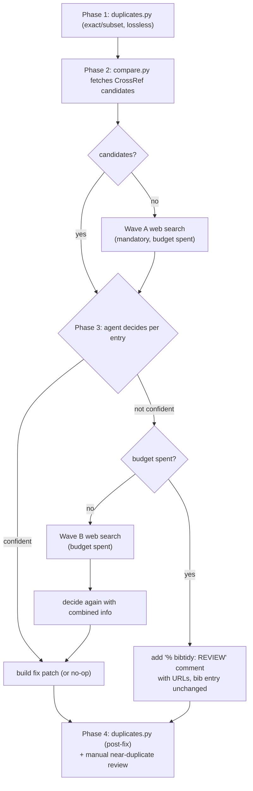

# bibtools

A bibliography toolkit for LaTeX, built as agent skills. Available for [Claude Code](https://docs.anthropic.com/en/docs/claude-code) and [Codex](https://openai.com/index/introducing-codex/).

**[bibtidy](#bibtidy)** — Cross-check BibTeX entries against Google Scholar, CrossRef, and conference/journal sites. Upgrades arXiv/bioRxiv preprints to published versions (even when the title changed upon publication), corrects metadata (authors, pages, venues), and flags duplicate entries.


## Install

Installation differs by platform. Claude Code uses the plugin marketplace; Codex uses native skill discovery.

### Claude Code

Add the marketplace in Claude Code:

```bash
/plugin marketplace add mathpluscode/bibtools
```

Install the plugin:

```bash
/plugin install bibtools@mathpluscode-bibtools
```

Reload plugins:

```bash
/reload-plugins
```

To update later, refresh the marketplace and reload:

```bash
/plugin marketplace update mathpluscode-bibtools
/reload-plugins
```

### Codex

Tell Codex:

```text
Fetch and follow instructions from https://raw.githubusercontent.com/mathpluscode/bibtools/main/.codex/INSTALL.md
```

To update later, ask Codex to pull the latest version:

```text
Update the bibtools skill: run `cd ~/.codex/bibtools && git pull`
```

Start a new Codex session afterwards so the refreshed `SKILL.md` is loaded into context.

## bibtidy

```text
Use bibtidy to validate and fix refs.bib
```

Or in Claude Code, use the slash command: `/bibtidy refs.bib`

bibtidy verifies each entry against [Google Scholar](https://scholar.google.com/) and [CrossRef](https://search.crossref.org/), fixes errors, and upgrades stale preprints to published versions. Every change includes the original entry commented out above so you can compare or revert, plus one or more `% bibtidy:` URL lines for verification. We recommend using git to track changes. If using [Overleaf](https://www.overleaf.com/), this can be done with [git sync](https://docs.overleaf.com/integrations-and-add-ons/git-integration-and-github-synchronization). To remove bibtidy comments after review, ask your agent to remove all `bibtidy` comments from the file.

bibtidy's output is non-deterministic: the same `.bib` file can yield different fixes across runs, and Claude Code and Codex may reach different conclusions on the same entry. See the [FAQ](#bibtidy) for why, and always verify changes via the `% bibtidy:` URLs before accepting them.

Note that bibtidy assumes standard brace-style BibTeX like `@article{...}`. Parenthesized forms like `@article(...)` are not supported. Special blocks such as `@string`, `@preamble`, and `@comment` are ignored by the parser.

### How it works

bibtidy walks each entry through a bounded state machine. Every entry has a **web-search budget of 1**, spent at most once across two possible waves:



Each entry ends in one of four states: **Clean** (no change, no comment), **Fix** (patch applied with URLs + explanation), **Not found** (hallucinated, entry commented out), or **Review** (budget spent, entry unchanged, comment added for human attention).

### Examples

<details>
<summary><b>Example 1</b>: Hallucinated reference flagged and commented out (<a href="https://openreview.net/forum?id=75SJoY9gTN">source</a>)</summary>

Before:
```bibtex
@article{wang2021identity,
  title={On the identity of the representation learned by pre-trained language models},
  author={Wang, Zijie J and Choi, Yuhao and Wei, Dongyeop},
  journal={arXiv preprint arXiv:2109.01819},
  year={2021}
}
```

After:
```bibtex
% bibtidy: NOT FOUND — no matching paper on CrossRef or web search; verify this reference exists
% @article{wang2021identity,
%   title={On the identity of the representation learned by pre-trained language models},
%   author={Wang, Zijie J and Choi, Yuhao and Wei, Dongyeop},
%   journal={arXiv preprint arXiv:2109.01819},
%   year={2021}
% }
```

</details>

<details>
<summary><b>Example 2</b>: Hallucinated metadata corrected (<a href="https://openreview.net/forum?id=HSi4VetQLj">source</a>)</summary>

Before:
```bibtex
@inproceedings{aichberger2025semantically,
  title={Semantically Diverse Language Generation},
  author={Aichberger, Franz and Chen, Lily and Smith, John},
  booktitle={International Conference on Learning Representations},
  year={2025}
}
```

After:
```bibtex
% @inproceedings{aichberger2025semantically,
%   title={Semantically Diverse Language Generation},
%   author={Aichberger, Franz and Chen, Lily and Smith, John},
%   booktitle={International Conference on Learning Representations},
%   year={2025}
% }
% bibtidy: https://openreview.net/forum?id=HSi4VetQLj
% bibtidy: corrected title and authors
@inproceedings{aichberger2025semantically,
  title={Improving Uncertainty Estimation through Semantically Diverse Language Generation},
  author={Aichberger, Lukas and Schweighofer, Kajetan and Ielanskyi, Mykyta and Hochreiter, Sepp},
  booktitle={International Conference on Learning Representations},
  year={2025}
}
```

</details>

<details>
<summary><b>Example 3</b>: Google Scholar adds editors as co-authors (<a href="https://scholar.google.co.uk/scholar?hl=en&as_sdt=0%2C5&q=Estimation+of+non-normalized+statistical+models+by+score+matching&btnG=">source</a>)</summary>

Before:
```bibtex
@article{hyvarinen2005estimation,
  title={Estimation of non-normalized statistical models by score matching.},
  author={Hyv{\"a}rinen, Aapo and Dayan, Peter},
  journal={Journal of Machine Learning Research},
  volume={6},
  number={4},
  year={2005}
}
```

After:
```bibtex
% @article{hyvarinen2005estimation,
%   title={Estimation of non-normalized statistical models by score matching.},
%   author={Hyv{\"a}rinen, Aapo and Dayan, Peter},
%   journal={Journal of Machine Learning Research},
%   volume={6},
%   number={4},
%   year={2005}
% }
% bibtidy: https://jmlr.org/papers/v6/hyvarinen05a.html
% bibtidy: removed "Dayan, Peter" — journal editor, not co-author; number 4 → 24
@article{hyvarinen2005estimation,
  title={Estimation of non-normalized statistical models by score matching},
  author={Hyv{\"a}rinen, Aapo},
  journal={Journal of Machine Learning Research},
  volume={6},
  number={24},
  year={2005}
}
```

</details>

<details>
<summary><b>Example 4</b>: arXiv preprint upgraded to published version (<a href="https://scholar.google.co.uk/scholar?hl=en&as_sdt=0%2C5&q=Flow+matching+for+generative+modeling&btnG=">source</a>)</summary>

Before:
```bibtex
@article{lipman2022flow,
  title={Flow matching for generative modeling},
  author={Lipman, Yaron and Chen, Ricky TQ and Ben-Hamu, Heli and Nickel, Maximilian and Le, Matt},
  journal={arXiv preprint arXiv:2210.02747},
  year={2022}
}
```

After:
```bibtex
% @article{lipman2022flow,
%   title={Flow matching for generative modeling},
%   author={Lipman, Yaron and Chen, Ricky TQ and Ben-Hamu, Heli and Nickel, Maximilian and Le, Matt},
%   journal={arXiv preprint arXiv:2210.02747},
%   year={2022}
% }
% bibtidy: https://openreview.net/forum?id=PqvMRDCJT9t
% bibtidy: published at ICLR 2023 (was arXiv preprint)
@inproceedings{lipman2022flow,
  title={Flow matching for generative modeling},
  author={Lipman, Yaron and Chen, Ricky TQ and Ben-Hamu, Heli and Nickel, Maximilian and Le, Matt},
  booktitle={International Conference on Learning Representations},
  year={2023}
}
```

</details>

<details>
<summary><b>Example 5</b>: arXiv preprint upgraded to published version with title change</summary>

Before:
```bibtex
@article{khader2022medical,
  title={Medical Diffusion--Denoising Diffusion Probabilistic Models for 3D Medical Image Generation},
  author={Khader, Firas and Mueller-Franzes, Gustav and Arasteh, Soroosh Tayebi and Han, Tianyu and Haarburger, Christoph and Schulze-Hagen, Maximilian and Schad, Philipp and Engelhardt, Sandy and Baessler, Bettina and Foersch, Sebastian and others},
  journal={arXiv preprint arXiv:2211.03364},
  year={2022}
}
```

After:
```bibtex
% @article{khader2022medical,
%   title={Medical Diffusion--Denoising Diffusion Probabilistic Models for 3D Medical Image Generation},
%   author={Khader, Firas and Mueller-Franzes, Gustav and Arasteh, Soroosh Tayebi and Han, Tianyu and Haarburger, Christoph and Schulze-Hagen, Maximilian and Schad, Philipp and Engelhardt, Sandy and Baessler, Bettina and Foersch, Sebastian and others},
%   journal={arXiv preprint arXiv:2211.03364},
%   year={2022}
% }
% bibtidy: https://doi.org/10.1038/s41598-023-34341-2
% bibtidy: updated from arXiv to published version (Scientific Reports 2023), title updated
@article{khader2022medical,
  title={Denoising Diffusion Probabilistic Models for 3D Medical Image Generation},
  author={Khader, Firas and Mueller-Franzes, Gustav and Arasteh, Soroosh Tayebi and Han, Tianyu and Haarburger, Christoph and Schulze-Hagen, Maximilian and Schad, Philipp and Engelhardt, Sandy and Baessler, Bettina and Foersch, Sebastian and others},
  journal={Scientific Reports},
  volume={13},
  year={2023}
}
```

</details>

<details>
<summary><b>Example 6</b>: Wrong page numbers corrected via CrossRef (<a href="https://scholar.google.co.uk/scholar?hl=en&as_sdt=0%2C5&q=Segmenter%3A+Transformer+for+semantic+segmentation&btnG=">source</a>)</summary>

Before:
```bibtex
@inproceedings{strudel2021segmenter,
  title={Segmenter: Transformer for semantic segmentation},
  author={Strudel, Robin and Garcia, Ricardo and Laptev, Ivan and Schmid, Cordelia},
  booktitle={Proceedings of the IEEE/CVF international conference on computer vision},
  pages={7262--7272},
  year={2021}
}
```

After:
```bibtex
% @inproceedings{strudel2021segmenter,
%   title={Segmenter: Transformer for semantic segmentation},
%   author={Strudel, Robin and Garcia, Ricardo and Laptev, Ivan and Schmid, Cordelia},
%   booktitle={Proceedings of the IEEE/CVF international conference on computer vision},
%   pages={7262--7272},
%   year={2021}
% }
% bibtidy: https://doi.org/10.1109/iccv48922.2021.00717
% bibtidy: corrected page range 7262--7272 → 7242--7252
@inproceedings{strudel2021segmenter,
  title={Segmenter: Transformer for semantic segmentation},
  author={Strudel, Robin and Garcia, Ricardo and Laptev, Ivan and Schmid, Cordelia},
  booktitle={Proceedings of the IEEE/CVF international conference on computer vision},
  pages={7242--7252},
  year={2021}
}
```

</details>

<details>
<summary><b>Example 7</b>: Author list expanded from "and others" to full list (<a href="https://doi.org/10.1109/ICCV51070.2023.00371">source</a>)</summary>

Before:
```bibtex
@inproceedings{kirillov2023segment,
  title={Segment anything},
  author={Kirillov, Alexander and Mintun, Eric and Ravi, Nikhila and Mao, Hanzi and Rolland, Chloe and Gustafson, Laura and Xiao, Tete and Whitehead, Spencer and Berg, Alexander C and Lo, Wan-Yen and others},
  booktitle={Proceedings of the IEEE/CVF International Conference on Computer Vision},
  pages={3992--4003},
  year={2023},
  doi={10.1109/ICCV51070.2023.00371}
}
```

After:
```bibtex
% @inproceedings{kirillov2023segment,
%   title={Segment anything},
%   author={Kirillov, Alexander and Mintun, Eric and Ravi, Nikhila and Mao, Hanzi and Rolland, Chloe and Gustafson, Laura and Xiao, Tete and Whitehead, Spencer and Berg, Alexander C and Lo, Wan-Yen and others},
%   booktitle={Proceedings of the IEEE/CVF International Conference on Computer Vision},
%   pages={3992--4003},
%   year={2023},
%   doi={10.1109/ICCV51070.2023.00371}
% }
% bibtidy: https://doi.org/10.1109/ICCV51070.2023.00371
% bibtidy: expanded author list from "and others" to full list
@inproceedings{kirillov2023segment,
  title={Segment anything},
  author={Kirillov, Alexander and Mintun, Eric and Ravi, Nikhila and Mao, Hanzi and Rolland, Chloe and Gustafson, Laura and Xiao, Tete and Whitehead, Spencer and Berg, Alexander C and Lo, Wan-Yen and Doll{\'a}r, Piotr and Girshick, Ross},
  booktitle={Proceedings of the IEEE/CVF International Conference on Computer Vision},
  pages={3992--4003},
  year={2023},
  doi={10.1109/ICCV51070.2023.00371}
}
```

</details>

<details>
<summary><b>Example 8</b>: bioRxiv preprint duplicated with published version</summary>

Before:
```bibtex
@article{watson2022broadly,
  title={Broadly applicable and accurate protein design by integrating structure prediction networks and diffusion generative models},
  author={Watson, Joseph L and Juergens, David and Bennett, Nathaniel R and Trippe, Brian L and Yim, Jason and Eisenach, Helen E and Ahern, Woody and Borst, Andrew J and Ragotte, Robert J and Milles, Lukas F and others},
  journal={BioRxiv},
  pages={2022--12},
  year={2022},
  publisher={Cold Spring Harbor Laboratory}
}

@article{watson2023novo,
  title={De novo design of protein structure and function with RFdiffusion},
  author={Watson, Joseph L and Juergens, David and Bennett, Nathaniel R and Trippe, Brian L and Yim, Jason and Eisenach, Helen E and Ahern, Woody and Borst, Andrew J and Ragotte, Robert J and Milles, Lukas F and others},
  journal={Nature},
  volume={620},
  pages={1089--1100},
  year={2023},
  publisher={Nature Publishing Group UK London}
}
```

After:
```bibtex
% bibtidy: DUPLICATE of watson2023novo — consider removing
@article{watson2022broadly,
  title={Broadly applicable and accurate protein design by integrating structure prediction networks and diffusion generative models},
  author={Watson, Joseph L and Juergens, David and Bennett, Nathaniel R and Trippe, Brian L and Yim, Jason and Eisenach, Helen E and Ahern, Woody and Borst, Andrew J and Ragotte, Robert J and Milles, Lukas F and others},
  journal={BioRxiv},
  pages={2022--12},
  year={2022},
  publisher={Cold Spring Harbor Laboratory}
}

@article{watson2023novo,
  title={De novo design of protein structure and function with RFdiffusion},
  author={Watson, Joseph L and Juergens, David and Bennett, Nathaniel R and Trippe, Brian L and Yim, Jason and Eisenach, Helen E and Ahern, Woody and Borst, Andrew J and Ragotte, Robert J and Milles, Lukas F and others},
  journal={Nature},
  volume={620},
  pages={1089--1100},
  year={2023},
  publisher={Nature Publishing Group UK London}
}
```

</details>

## FAQ

### General

**Do I need a paid subscription?**

Claude Code requires a paid plan (there is no free tier). Codex offers a free tier, so you can use bibtools with Codex at no cost.

**Why an agent skill/plugin instead of a Python package?**

Building on agent-native search and editing keeps the codebase small. The skill/plugin reuses existing web, editing, and subagent capabilities rather than reimplementing HTTP clients, parsers, and retry logic.

bibtidy needs to search Google Scholar, CrossRef, and conference/journal sites. Google Scholar has no official API and bans scrapers; Semantic Scholar's public API (1,000 req/s) is shared globally so availability is unpredictable. Agent environments with built-in web access sidestep both problems, no API keys, no shared rate limits. Citation metadata (title, authors, venue, year) is almost never behind a paywall, so the agent can simply visit the publisher page and read the correct information.

### bibtidy

**How can I trust bibtidy's output?**

You shouldn't, and that's by design. The point of bibtidy is to surface potential hallucinations and errors in your bibliography. For every changed entry, bibtidy includes a `% bibtidy:` URL so you can verify the correction yourself. Entries marked unchanged are very likely correct, but not guaranteed. Always check the provided links before accepting changes.

**Why do I get different results on different runs, or between Claude Code and Codex?**

bibtidy is non-deterministic. Running it twice on the same `.bib` file can produce different fixes, and Claude Code and Codex may reach different conclusions on the same entry. There are a few reasons for this:

- Search results vary between queries. Google Scholar and CrossRef can return slightly different candidate sets for the same title, and the web itself changes over time as new publications, DOIs, and venue pages appear.
- Agent decisions depend on LLM sampling, which is stochastic. Given ambiguous evidence (e.g. a preprint with a near-match published version), different runs may land on `fix`, `review`, or `unchanged`.
- Claude Code and Codex use different underlying models with different tool surfaces, so their web-search behavior and judgment thresholds differ.

This is why every change ships with `% bibtidy:` URLs: you should treat bibtidy's output as a reviewed first draft, not a final answer. Re-running on an already-tidied file is safe, and a second pass sometimes catches issues missed in the first.

**How does bibtidy compare to other tools?**

[CiteAudit](https://arxiv.org/abs/2602.23452) verifies bibliographic metadata but is a closed system. bibtidy is fully open-source, transparent (every change includes the original entry commented out and a source URL so you can verify exactly what changed and why), and it fixes issues (wrong authors, stale preprints, incorrect pages) directly in your .bib file rather than just flagging them.

[refchecker](https://github.com/markrussinovich/refchecker) verifies references against Semantic Scholar, OpenAlex, and CrossRef, and uses LLM-powered web search to flag fabricated references. It reports problems but does not auto-fix them. bibtidy applies corrections in place so you review a diff, not a report. bibtidy also upgrades stale arXiv/bioRxiv preprints to their published versions (even when the title changed on publication), and requires no setup beyond installing the skill.

[bibtex-tidy](https://github.com/FlamingTempura/bibtex-tidy) reformats and deduplicates .bib files but does not verify metadata against external sources. bibtidy checks correctness, not just formatting.

[arxiv-latex-cleaner](https://github.com/google-research/arxiv-latex-cleaner) is a file cleanup tool for arXiv submissions (removing comments, resizing figures, etc.), it does not verify or correct any bibliographic metadata.

**Why does bibtidy flag so many page number errors?**

Google Scholar extracts metadata by scraping PDFs rather than querying publisher databases, so page numbers are frequently incorrect. Even official sources can disagree, for example, the same CVPR 2020 paper "Momentum Contrast for Unsupervised Visual Representation Learning" has pages 9729--9738 on [CVF Open Access](https://openaccess.thecvf.com/content_CVPR_2020/html/He_Momentum_Contrast_for_Unsupervised_Visual_Representation_Learning_CVPR_2020_paper.html) but pages 9726--9735 on [IEEE Xplore](https://ieeexplore.ieee.org/document/9157636), because IEEE re-paginates when compiling the full proceedings volume. bibtidy uses CrossRef as the authoritative source for page numbers. CrossRef gets metadata directly from publishers via DOI registration, so for IEEE/CVF conferences it returns the IEEE Xplore pagination (9726--9735 in the example above). bibtidy applies the DOI-linked version; you can verify via the DOI URL included in the `% bibtidy:` comments.

## License

MIT
